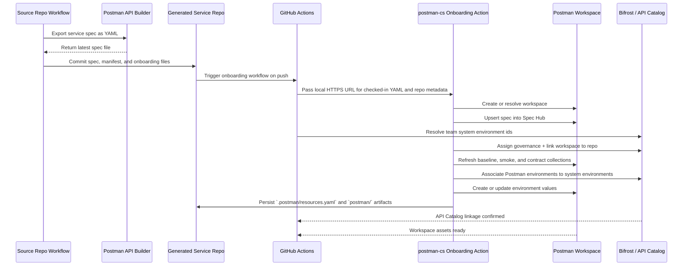

# Pipeline Diagram

This document shows the customer-facing flow for exporting API Builder specs, generating a dedicated service repo, and provisioning a dedicated Postman workspace from that repo.

## End-to-End Flow

```mermaid
flowchart LR
    subgraph source["Source Repo: Cust-Grubhub-engagement-kit"]
        CFG["config/api-builder-services.json"]
        EXP["export-api-builder-services.yml"]
        SCR["export-api-builder-service.js"]
    end

    subgraph builder["Postman API Builder"]
        SRCWS["Source workspace"]
        SRCSPEC["Service YAML specs"]
    end

    subgraph github["GitHub"]
        TARGET["Dedicated service repo"]
        TARGETWF["onboard-to-postman.yml"]
        SHARED["postman-cs/postman-api-onboarding-action@v0"]
        BOOTSTRAP["postman-cs/postman-bootstrap-action"]
        REPOSYNC["postman-cs/postman-repo-sync-action"]
    end

    subgraph postman["Postman Workspace + API Catalog"]
        BIFROST["Bifrost workspace link"]
        CATALOG["API Catalog / Governance"]
        SPEC["Spec Hub spec"]
        BASELINE["Baseline collection"]
        SMOKE["Smoke collection"]
        CONTRACT["Contract collection"]
        ENV["Environment(s)"]
    end

    subgraph runtime["Customer Runtime"]
        API["Customer API deployment"]
        QA["Smoke runs and QA"]
    end

    CFG --> EXP
    EXP --> SCR
    SRCWS --> SRCSPEC
    SRCSPEC -->|export YAML| SCR
    SCR -->|create or update repo| TARGET
    TARGET -->|push YAML to main| TARGETWF
    TARGETWF --> SHARED
    SHARED --> BOOTSTRAP
    SHARED --> REPOSYNC
    BOOTSTRAP -->|create workspace + upload spec| SPEC
    BOOTSTRAP -->|governance mapping| CATALOG
    TARGETWF -->|discover team system env ids| BIFROST
    REPOSYNC -->|link workspace to repo via Bifrost| BIFROST
    BIFROST --> CATALOG
    SHARED -->|upsert workspace + spec| SPEC
    SPEC --> BASELINE
    SPEC --> SMOKE
    SPEC --> CONTRACT
    SHARED --> ENV
    ENV --> BASELINE
    ENV --> SMOKE
    ENV --> CONTRACT
    BASELINE --> API
    SMOKE --> QA
```

## Provisioning Sequence

## Notes

- The source repo exports specs from API Builder and seeds one GitHub repo per service.
- Each generated service repo owns one dedicated Postman workspace and one corresponding Spec Hub asset.
- The generated repo hands its checked-in YAML to `postman-cs/postman-api-onboarding-action@v0`, which chains bootstrap plus repo sync.
- The shared action workflow persists Postman asset ids back into `.postman/resources.yaml` and seeds repo variables so reruns stay bound to the same workspace, spec, collections, mock, monitor, team id, and resolved system environment ids. Collection sync defaults to `reuse` for stable customer workspaces unless the repo opts into `refresh` or `version`.
- Generated repos explicitly run with `integration-backend: bifrost`, auto-discover team system environments when no override map is supplied, and fail the onboarding workflow when repo sync does not report successful Bifrost workspace linking and environment association into the API Catalog path.
