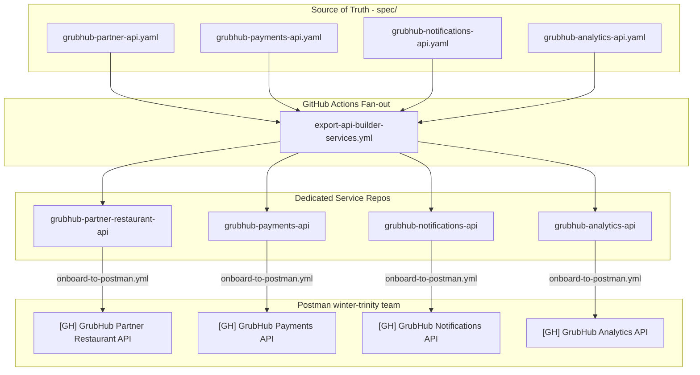
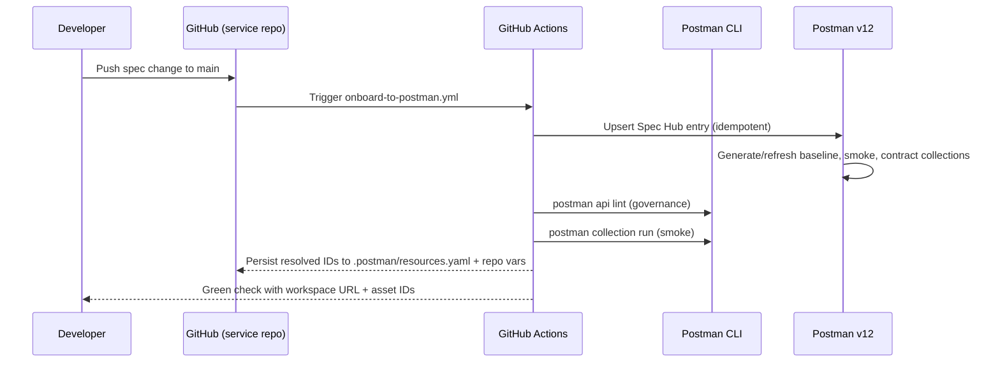

# GrubHub × Postman Engagement Kit

A food-delivery themed multi-service API portfolio that demonstrates **Postman v12 Enterprise** with **Git-native integration**, repo-per-service onboarding, idempotent provisioning, and Postman-CLI-driven governance + automated testing — all on GitHub Actions.

## What this repo delivers

- 4 OpenAPI specs in `spec/` as the single source of truth for GrubHub APIs (Partner Restaurant, Payments, Notifications, Analytics).
- A fan-out GitHub Actions pipeline (`.github/workflows/export-api-builder-services.yml`) that scaffolds a dedicated GitHub repo per service and a dedicated Postman workspace per service under GrubHub's Postman team.
- Per-service onboarding workflow that uses `postman-cs/postman-api-onboarding-action@v0` to stand up the workspace, spec, baseline/smoke/contract collections, environments, monitor, and mock server.
- Postman CLI steps (`postman api lint`, `postman collection run`) baked into every generated service repo for governance and automated smoke testing.
- Idempotency guaranteed by three layers: (1) concurrency group + bot-commit guard in the onboarding workflow, (2) resolved IDs persisted back to `.postman/resources.yaml` and repo variables after the first run, (3) in-place `PUT` updates in `scripts/onboard-to-postman.js` so spec UIDs stay stable across re-runs.

## Application Flow



## Git Sync Workflow (per service)



## Running the full pipeline

This repo is already wired to run against the `winter-trinity-948108` Postman team (ID `13569807`). To re-run the full pipeline and refresh all four service workspaces:

```bash
gh workflow run export-api-builder-services.yml \
  --repo shivemind/Cust-Grubhub-engagement-kit \
  --ref main
```

That dispatch will:

1. Read `config/api-builder-services.json` (local-spec source, team `13569807`, Bifrost soft-required).
2. Scaffold four target repos under `shivemind/` (creating them if they do not exist).
3. Seed each target repo with `POSTMAN_API_KEY` and `GH_FALLBACK_TOKEN` secrets.
4. Push the generated scaffold, which auto-triggers `onboard-to-postman.yml` on the target repo.
5. Each target repo onboards its spec to Postman, runs governance lint + smoke tests, and commits the resolved Postman IDs back into Git.

## Required secrets

### On this repo (`shivemind/Cust-Grubhub-engagement-kit`)

| Type | Name | Required | Purpose |
|---|---|---|---|
| Secret | `POSTMAN_API_KEY` | **Yes** | PMAK used to provision workspaces, specs, collections, environments, mocks, and monitors. |
| Secret | `GH_REPO_ADMIN_TOKEN` | **Yes** | PAT with `repo` scope that can create target repos, seed their secrets, and push scaffolds. |
| Secret | `POSTMAN_ACCESS_TOKEN` | Optional | Postman access token for Bifrost / API Catalog integration. When absent, the onboarded repos skip Bifrost cleanly (workspace creation, collection generation, etc. still work). |

### On each generated service repo

The fan-out seeds these automatically. No manual setup is required after dispatch.

| Type | Name | Populated from |
|---|---|---|
| Secret | `POSTMAN_API_KEY` | `shivemind/Cust-Grubhub-engagement-kit` `POSTMAN_API_KEY` |
| Secret | `GH_FALLBACK_TOKEN` | `shivemind/Cust-Grubhub-engagement-kit` `GH_REPO_ADMIN_TOKEN` (used by the persist-IDs step to write repo variables) |
| Secret | `POSTMAN_ACCESS_TOKEN` | Only set if `POSTMAN_ACCESS_TOKEN` is configured on this repo |

## Idempotency

Re-running the onboarding workflow on any generated repo is safe. Evidence:

- Concurrency group `postman-onboarding-${{ github.repository }}` prevents overlapping runs on the same repo.
- The workflow skips itself on auto-commits whose message begins with `chore: sync Postman artifacts and metadata` or `chore: persist Postman spec mapping` to prevent self-trigger loops.
- Before calling the shared action, the workflow reads `.postman/resources.yaml` and repo variables (`POSTMAN_WORKSPACE_ID`, `POSTMAN_SPEC_ID`, `POSTMAN_*_COLLECTION_ID`, `POSTMAN_MONITOR_ID`, `POSTMAN_MOCK_URL`, `POSTMAN_ENVIRONMENT_UIDS_JSON`) and passes them as inputs, so the action updates-in-place instead of creating duplicates.
- `spec-sync-mode: update` and `collection-sync-mode: reuse` are the defaults in the generated template.
- `scripts/onboard-to-postman.js` (this repo's direct onboarder) uses `PUT /specs/:id/files/:path` instead of delete+create, keeping spec UIDs stable across re-runs.

## Postman CLI governance + automated testing

Each generated service repo runs these Postman CLI steps at the end of its onboarding workflow:

| Step | Command | Behavior |
|---|---|---|
| Install Postman CLI | `curl dl-cli.pstmn.io/install/linux64.sh \| sh` | Standard install on the runner. |
| Governance lint | `postman api lint "$SPEC_PATH"` | Surfaces OpenAPI style violations as workflow annotations. Non-blocking (`continue-on-error: true`). |
| Smoke test | `postman collection run <smoke-id> --environment <env-uid> --bail` | Runs the auto-generated smoke collection against the dev environment. Non-blocking so runner-local URL failures don't block promotion. |

Point the `dev` environment at a reachable URL (e.g. `vars.POSTMAN_MOCK_URL` or a real staging host) to have smoke tests go fully green.

## Provisioned Postman resources (current demo state)

All four services are onboarded to Postman team `winter-trinity-948108` (team ID `13569807`):

| Service | Target repo | Postman workspace ID | Spec ID |
|---|---|---|---|
| Partner Restaurant API | `shivemind/grubhub-partner-restaurant-api` | `c1f1e4c3-1dfb-4a55-a58c-36badd6adf4e` | `139137a8-7a79-497a-91f0-ef3c3974cfa2` |
| Payments API | `shivemind/grubhub-payments-api` | `a7da14ca-d31f-4ac1-bace-e75162ae5f1b` | `841038f0-6739-4fee-8d7a-b90a9d53d6b6` |
| Notifications API | `shivemind/grubhub-notifications-api` | `8d130543-081d-4a4f-a75d-ed82c7800b20` | `8d0f908c-17b5-4ab3-a0fb-9c9112ed8b32` |
| Analytics API | `shivemind/grubhub-analytics-api` | `82482a58-8248-4904-b3d1-753e91e81fc9` | `b008a402-6565-4582-9558-3928ae248898` |

Each generated workspace also has: baseline collection, smoke collection, contract collection, dev + prod environments, smoke monitor, and a Postman mock server. Full IDs are written back to the target repo's Actions variables after every successful run.

## Local demo app

A small Express 5 app in this repo serves the Partner Restaurant API for in-person demos.

```bash
npm install
npm start
# http://localhost:3000
```

The UI has three tabs: Demo Script teleprompter, API Explorer, and GrubHub-branded slides.

### API endpoints (local app)

All endpoints prefixed with `/api/v1` and require `X-API-Key: grubhub-demo-key-2026` (except `/health`).

| Resource | Endpoints |
|----------|-----------|
| **Restaurants** | `GET /restaurants`, `GET /restaurants/:id`, `POST /restaurants`, `PUT /restaurants/:id`, `DELETE /restaurants/:id` |
| **Menus** | `GET /restaurants/:id/menu`, `POST /restaurants/:id/menu/items`, `PUT /menu/items/:id`, `DELETE /menu/items/:id` |
| **Orders** | `POST /orders`, `GET /orders/:id`, `GET /orders`, `PUT /orders/:id/status` |
| **Delivery** | `GET /deliveries/:orderId/tracking`, `PUT /deliveries/:orderId/assign`, `GET /deliveries/active` |
| **Health** | `GET /health` |

## Project structure

```
Cust-Grubhub-engagement-kit/
├── spec/
│   ├── grubhub-partner-api.yaml          # Partner Restaurant — source of truth
│   ├── grubhub-payments-api.yaml         # Payments
│   ├── grubhub-notifications-api.yaml    # Notifications
│   └── grubhub-analytics-api.yaml        # Analytics
├── config/
│   ├── api-builder-services.json         # Active service inventory
│   └── api-builder-services.example.json # Reference with all optional fields
├── templates/service-repo/               # Scaffold emitted into each generated repo
│   ├── .github/workflows/onboard-to-postman.yml.tpl
│   ├── scripts/resolve-system-env-map.js.tpl
│   └── README.md.tpl
├── scripts/
│   ├── build-api-builder-matrix.js       # Expands config into matrix strategy
│   ├── export-api-builder-service.js     # Emits per-service scaffold
│   └── onboard-to-postman.js             # Idempotent upsert for this repo's spec
├── .github/workflows/
│   ├── export-api-builder-services.yml   # Fan-out pipeline
│   └── postman-tests.yml                 # Postman CLI governance + tests for this repo
├── server.js, api/, public/, k8s/        # Local Express 5 demo app + UI
└── .postman/resources.yaml               # Optional local Git-Sync binding for this repo
```

## Additional references

- `PIPELINE_DIAGRAM.md` — standalone visual of the end-to-end fan-out pipeline.
- `config/api-builder-services.example.json` — reference config showing every optional field (governance mapping, system env map, requester email, org mode, etc.).
