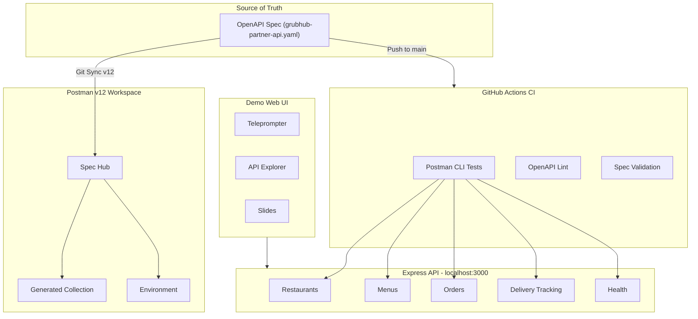
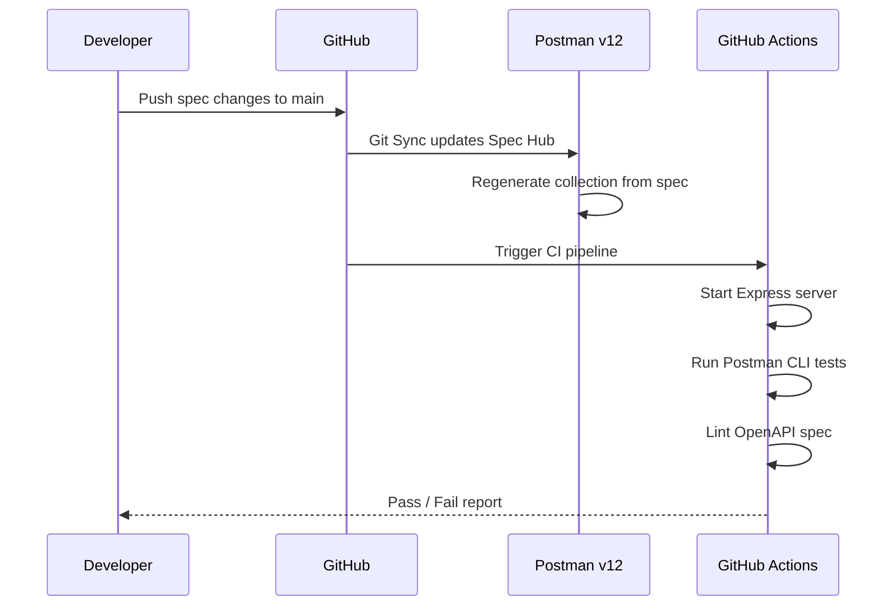
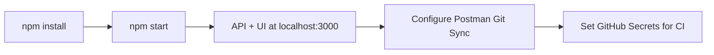

# Cust-Grubhub-engagement-kit

A food-delivery themed API service built to demonstrate **Postman v12 Enterprise** capabilities to GrubHub.

## Application Flow



## Git Sync Workflow



## Quick Start

```bash
npm install
npm start
```

The API and demo web UI are available at **http://localhost:3000**.

## Setup



### Connecting Git Sync (Postman v12)

1. Create or open the Postman workspace you want to use for this repo
2. Import or generate the API assets from `spec/grubhub-partner-api.yaml`
3. Go to the **Source Control** tab in Postman
4. Click **Connect to Git Repository**
5. Select **GitHub** and authorize Postman if prompted
6. Choose this repository and set branch to `main`
7. Set the spec file path to `spec/grubhub-partner-api.yaml`
8. Click **Connect**

`.postman/resources.yaml` intentionally ships without a workspace ID so the repo does not point at any internal Postman workspace by default.

### GitHub Actions CI

Add these GitHub secrets/variables to enable CI:

| Type | Name | Value |
|---|---|---|
| Secret | `POSTMAN_API_KEY` | Your Postman API key |
| Variable | `POSTMAN_WORKSPACE_ID` | Workspace ID to use for the root repo onboarding workflow |
| Variable | `POSTMAN_COLLECTION_ID` | Optional collection UID to run in CI |
| Variable | `POSTMAN_ENVIRONMENT_ID` | Optional environment UID paired with `POSTMAN_COLLECTION_ID` |

### API Builder Export Workflow

This repo now includes `.github/workflows/export-api-builder-services.yml` for the repo-per-service flow:

1. Export a YAML spec from Postman API Builder
2. Scaffold a dedicated GitHub repo for that service
3. Push the spec and onboarding files into the new repo
4. Let the target repo provision its own Postman workspace and Spec Hub assets on push

Fill `config/api-builder-services.json` with the source spec IDs, file paths, target repo names, and the dedicated Postman workspace ID for each generated repo. You can also set `default_service_api_key` and optional `environment_values` there so the generated workspace environments are runnable on first bootstrap. Generated repos now create both a full API collection and a smoke-safe collection; the smoke collection is intended for monitors and customer-safe runner usage. A sample shape with placeholder values is included in `config/api-builder-services.example.json`.

Required secrets for the export workflow:

| Type | Name | Value |
|---|---|---|
| Secret | `POSTMAN_API_KEY` | Postman API key used to export from API Builder |
| Secret | `POSTMAN_ACCESS_TOKEN` | Postman access token alternative for export and generated repo onboarding |
| Secret | `GH_REPO_ADMIN_TOKEN` | GitHub token that can create repos, set repo secrets, and push commits |

## API Endpoints

All endpoints are prefixed with `/api/v1` and require an `X-API-Key` header.

| Resource | Endpoints |
|----------|-----------|
| **Restaurants** | `GET /restaurants`, `GET /restaurants/:id`, `POST /restaurants`, `PUT /restaurants/:id`, `DELETE /restaurants/:id` |
| **Menus** | `GET /restaurants/:id/menu`, `POST /restaurants/:id/menu/items`, `PUT /menu/items/:id`, `DELETE /menu/items/:id` |
| **Orders** | `POST /orders`, `GET /orders/:id`, `GET /orders`, `PUT /orders/:id/status` |
| **Delivery** | `GET /deliveries/:orderId/tracking`, `PUT /deliveries/:orderId/assign`, `GET /deliveries/active` |
| **Health** | `GET /health` (no auth required) |

### Authentication

Include the header `X-API-Key: grubhub-demo-key-2026` with every request (except health).

## Demo Web UI

The UI at `http://localhost:3000` has three tabs:

- **Demo Script** — Teleprompter with auto-scroll for the presentation script
- **API Explorer** — Click-to-execute interface for all API endpoints
- **Slides** — GrubHub-branded presentation slides with keyboard navigation

## Project Structure

```
Cust-Grubhub-engagement-kit/
├── server.js                    # Express 5 entry point
├── spec/
│   └── grubhub-partner-api.yaml # OpenAPI 3.0 source of truth
├── api/
│   ├── routes/                  # restaurants, menus, orders, delivery
│   ├── middleware/apiKey.js      # X-API-Key auth
│   └── data/seed.js             # In-memory demo data
├── public/                      # Demo UI (HTML/CSS/JS)
├── scripts/
│   └── onboard-to-postman.js    # Workspace setup via Postman API
├── k8s/                         # Kubernetes deployment manifest
├── .github/workflows/           # CI pipeline
└── .postman/resources.yaml      # Optional local Postman workspace metadata
```
