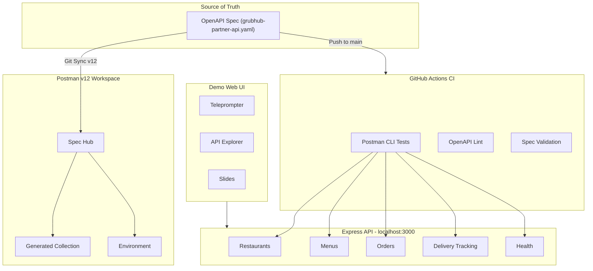
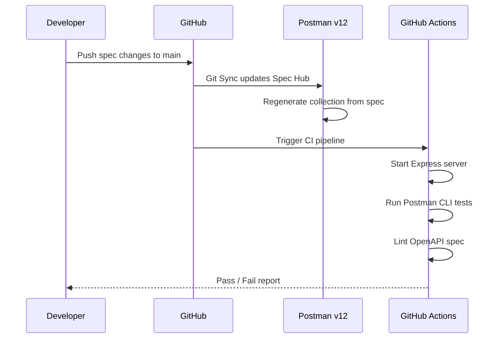
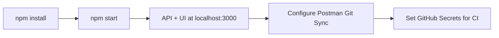

# Cust-GRUBHUB-v12-demo

A food-delivery themed API service built to demonstrate **Postman v12 Enterprise** capabilities to GrubHub.

## Application Flow



## Git Sync Workflow



## Quick Start

```bash
npm install
npm start
```

The API and demo web UI are available at **http://localhost:3000**.

## Setup



### Connecting Git Sync (Postman v12)

1. Open the **GrubHub V12 Demo** workspace in Postman
2. Click the collection **GrubHub Partner Restaurant API**
3. Go to the **Source Control** tab (branch icon in the right sidebar)
4. Click **Connect to Git Repository**
5. Select **GitHub** and authorize Postman if prompted
6. Choose repository and set branch to `main`
7. Set the spec file path to `spec/grubhub-partner-api.yaml`
8. Click **Connect**

### GitHub Actions CI

Add these GitHub secrets/variables to enable CI:

| Type | Name | Value |
|---|---|---|
| Secret | `POSTMAN_API_KEY` | Your Postman API key |
| Variable | `POSTMAN_COLLECTION_ID` | `21b66ff0-513a-45ba-834f-9f759c1e36e5` |
| Variable | `POSTMAN_ENVIRONMENT_ID` | `7f0494fc-28d6-4cdf-9abb-ab7823eafeb3` |

## API Endpoints

All endpoints are prefixed with `/api/v1` and require an `X-API-Key` header.

| Resource | Endpoints |
|----------|-----------|
| **Restaurants** | `GET /restaurants`, `GET /restaurants/:id`, `POST /restaurants`, `PUT /restaurants/:id`, `DELETE /restaurants/:id` |
| **Menus** | `GET /restaurants/:id/menu`, `POST /restaurants/:id/menu/items`, `PUT /menu/items/:id`, `DELETE /menu/items/:id` |
| **Orders** | `POST /orders`, `GET /orders/:id`, `GET /orders`, `PUT /orders/:id/status` |
| **Delivery** | `GET /deliveries/:orderId/tracking`, `PUT /deliveries/:orderId/assign`, `GET /deliveries/active` |
| **Health** | `GET /health` (no auth required) |

### Authentication

Include the header `X-API-Key: grubhub-demo-key-2026` with every request (except health).

## Demo Web UI

The UI at `http://localhost:3000` has three tabs:

- **Demo Script** — Teleprompter with auto-scroll for the presentation script
- **API Explorer** — Click-to-execute interface for all API endpoints
- **Slides** — GrubHub-branded presentation slides with keyboard navigation

## Project Structure

```
Cust-GRUBHUB-v12-demo/
├── server.js                    # Express 5 entry point
├── spec/
│   └── grubhub-partner-api.yaml # OpenAPI 3.0 source of truth
├── api/
│   ├── routes/                  # restaurants, menus, orders, delivery
│   ├── middleware/apiKey.js      # X-API-Key auth
│   └── data/seed.js             # In-memory demo data
├── public/                      # Demo UI (HTML/CSS/JS)
├── scripts/
│   └── onboard-to-postman.js    # Workspace setup via Postman API
├── k8s/                         # Kubernetes deployment manifest
├── .github/workflows/           # CI pipeline
└── .postman/resources.yaml      # Git-connected workspace config
```
